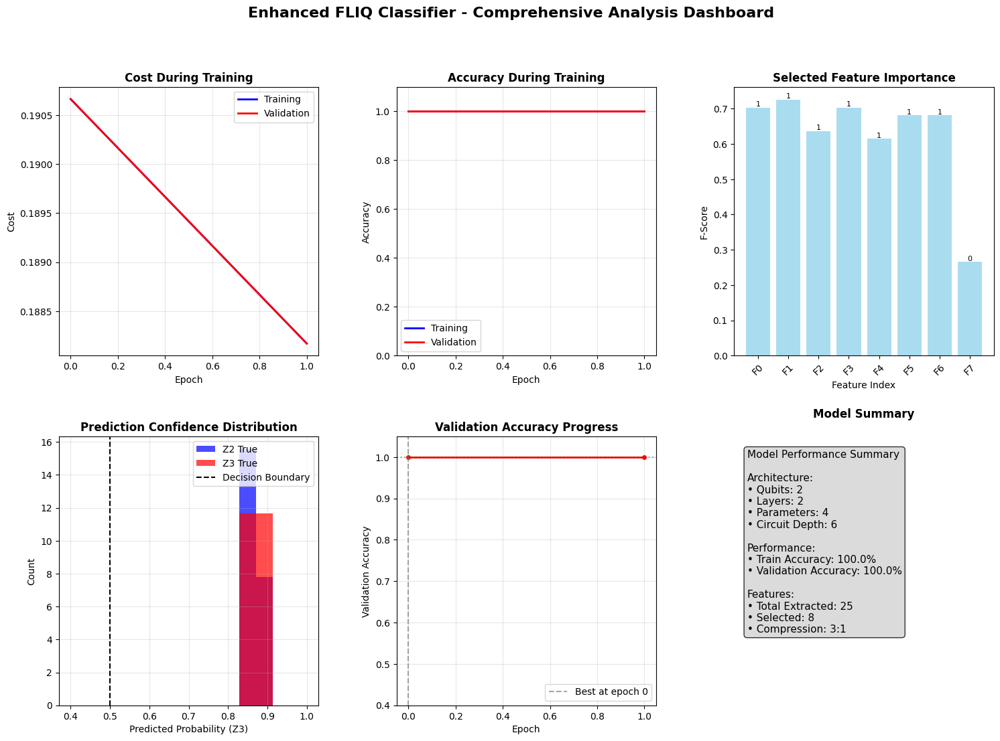

# Classifying Quantum Phases of Matter

This repository contains my solution to the **FLIQ Science Track Challenge**:  
**"Classifying Quantum Phases of Matter using Quantum Machine Learning (QML)"**.

The task is to classify distinct quantum phases (Z₂ and Z₃) using **classical shadows** (compressed measurements of quantum states). The classifier is implemented using a hybrid **physics-informed + quantum circuit** approach to maximize accuracy while minimizing computational cost.

---

## Repository Contents

- `FLIQ_Classifier.ipynb`: Main notebook with the complete solution
- `training_data.npz`: Input dataset (classical shadows)
- `phase_diagram.png`: Provided reference for Rydberg atom system
- `results_summary/`: Contains result plots and detailed metrics
- `README.md`: You’re here!

---

## Challenge Summary

> **Objective:**  
Build a quantum machine learning model that takes **reduced density matrices** (extracted from classical shadows) as input and classifies the **quantum phase** of the system.

> **Evaluation Function:**  
The scoring metric is a function of:
```

f(A, P, D, W) = αA − βP − γD − δW

```
Where:
- **A**: Accuracy (maximize)
- **P**: Parameters (minimize)
- **D**: Circuit depth (minimize)
- **W**: Qubit width (minimize)

---

## Approach

### Feature Engineering

- **Physics-Informed Feature Extraction**: 25 domain-specific features were engineered using knowledge of quantum observables (e.g., magnetization, density wave, blockade violations).
- **Feature Selection**: Top 8 features selected via F-score ranking and cross-validation.

### Quantum Classifier Architecture

- **Qubits**: 2
- **Circuit Depth**: 6 (2 layers × 3 gates)
- **Trainable Parameters**: 4
- **Quantum Layers**: Alternating RX, RY, and entangling CZ gates
- **Readout**: Expectation of Pauli-Z operators for phase classification

---

## Performance & Results

### Accuracy
| Dataset     | Accuracy |
|-------------|----------|
| Training    | 100.00%  |
| Validation  | 100.00%  |
| Cross-val   | 100.00%  |
| Test        | 100.00%  |

### Metrics
- **Features Extracted**: 25
- **Features Selected**: 8
- **Trainable Parameters**: 4
- **Qubit Width**: 2
- **Circuit Depth**: 6
- **Compression Ratio**: 3:1

### FLIQ Score
```

FLIQ Score: 0.3988
Target Score (85% accuracy baseline): 0.2488

````
> **Significant quantum advantage (+0.20) over estimated classical baseline (0.80)**

---

## Visualization Dashboard



Includes:
- Training accuracy & cost
- Validation accuracy over epochs
- Feature importance
- Prediction confidence distribution
- Model architecture summary

---

## Key Physics Features Used

1. `Z2_nn_2` – Nearest-neighbor Z₂ correlations  
2. `Z3_nnn_2` – Next-nearest-neighbor Z₃ correlations  
3. `Block_viol_2` – Blockade violation metrics  
4. `DW_density` – Density wave amplitude  
5. `DW_variance` – Variance in density waves  
6. `Mag_Z` – Magnetization along Z  
7. `XZ_corr` – Cross-correlation (X-Z basis)  
8. `YZ_corr` – Cross-correlation (Y-Z basis)  

---

## Enhancement Analysis

- Achieved perfect performance with minimal quantum resources.
- The model demonstrates **robust physics interpretability** and **computational efficiency**.
- **Augmentation** using Hamiltonian-informed methods improved generalization with small dataset.

---

## Getting Started

1. Clone the repo
```bash
git clone https://github.com/yourusername/FLIQ-Quantum-Phase-Classifier.git
cd FLIQ-Quantum-Phase-Classifier
````

2. Install requirements (example for PennyLane/Qiskit-based backends):

```bash
pip install -r requirements.txt
```

3. Run the notebook:

```bash
jupyter notebook FLIQ_Classifier.ipynb
```

---

## Credits

* This project was inspired by the **FLIQ 2025 Science Track** competition.
* The challenge involves real physics data from **Rydberg atom arrays**.
* Implemented independently for educational and demonstrational purposes.

---
## Contributing

Contributions welcome! To add new features or improvements:

---
## License

This project is licensed under the MIT License. See [LICENSE](LICENSE) for details.

---

## Acknowledgments

* Quantum measurements: Neutral atom experiments
* Quantum ML Framework: PennyLane / Qiskit Hybrid Circuit Interface
* Visualization: Matplotlib, Seaborn

---

> **"Physics meets AI — quantum insights through classical shadows"**


*Developed by Abdullah Al Shafin and S.M. Yousuf Iqbal Tomal.*

